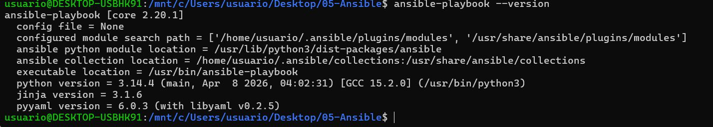
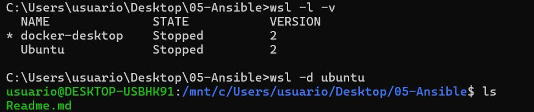
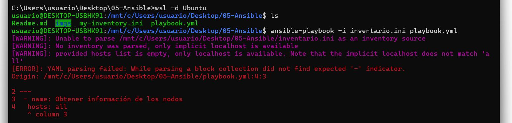
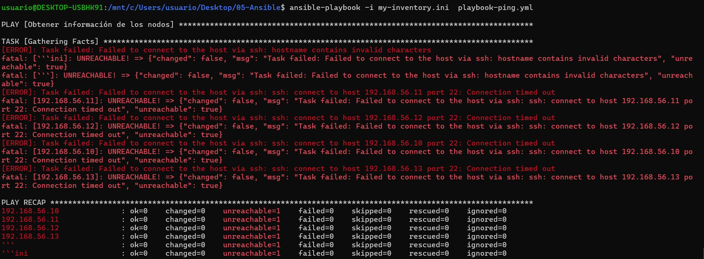

 
# Practica 05 Ansible
## 1. Explica que es Ansible


Ansible es una herramienta de automatización de sistemas utilizada para configurar servidores, desplegar aplicaciones y administrar infraestructura de forma automática. Fue creada para simplificar tareas repetitivas de administración de sistemas y actualmente es muy usada en entornos DevOps y cloud.

Una de las principales ventajas de Ansible es que funciona de manera agentless, es decir, no necesita instalar programas adicionales en los equipos remotos. Normalmente se conecta mediante SSH en Linux o WinRM en Windows para ejecutar las tareas.

## 1.1. Inventario

El Inventario es el archivo donde se define qué equipos va a administrar Ansible.

En este archivo se indican:

 * direcciones IP
 * nombres de host
 * grupos de servidores
 * variables asociadas


## 1.2. Playbook

Un Playbook es un archivo escrito normalmente en YAML que contiene las tareas que Ansible debe ejecutar.

Los Playbooks permiten automatizar procesos complejos de manera ordenada y reutilizable.

Es básicamente la “receta” de automatización.

 ``` yaml

- hosts: web
  become: yes

  tasks:
    - name: Instalar nginx
      apt:
        name: nginx
        state: present
```

Este Playbook indica: 
* hosts : servidores donde se aplica
* become : Obtener privilegios de administrador
* tasks : Ejecutar acciones sobre el grupo web Instalar Nginx
* apt, name y  state

Se lanzan ambos con 
``` 
ansible-playbook -i inventario.ini playbook.yml
```


## 2. ¿Que es un ad-hoc command?

En Ansible, un ad-hoc command es un comando rápido que se ejecuta directamente desde la terminal para realizar una tarea concreta en uno o varios equipos, sin necesidad de crear un Playbook.

``` bash
ansible <grupo> -m <modulo> -a "<argumentos>"
```
 
Donde:

* <grupo> → equipos del inventario
* -m → módulo que se utilizará
* -a → argumentos del módulo

ejemplos

```
ansible all -m ping

ansible web -m service -a "name=nginx state=restarted"

ansible db -m apt -a "name=mysql-server state=present" --become

ansible all -m copy -a "src=test.txt dest=/tmp/test.txt"
```

## Instalacion Ansible

Ansible no se puede instalar de forma nativa en Windows. Para utilizarlo como "nodo de control" desde tu equipo, debes instalar el Subsistema de Windows para Linux (WSL) y ejecutarlo sobre una distribución de Linux (como Ubuntu), lo que te permitirá gestionar tus servidores desde la comodidad de tu entorno

``` shell 
wsl --install
```

``` bash 
sudo apt update && sudo apt upgrade -y

sudo apt install software-properties-common -y

sudo add-apt-repository --yes --update ppa:ansible/ansible

sudo apt install ansible -y
```



ojo si te sales tienes que volver entrar a ese ubuntu usa 
``` bash 
wsl -l -v

 ``` 
 ``` bash 
C:\Users\usuario\Desktop\05-Ansible>wsl -l -v
  NAME              STATE           VERSION
* docker-desktop    Stopped         2
  Ubuntu            Stopped         2
  ``` 
 ``` bash 
C:\Users\usuario\Desktop\05-Ansible>wsl -d  Ubuntu
  ```



## 3. Crea un inventario con las siguientes características:


El nodo de control se encuentra en la IP: 192.168.56.10
Los nodos con arquitectura ARM en las IPs: 192.168.56.11, 192.168.56.12
Un nodo de arquitectura AMD en la IP: 192.168.56.13


``` shell 
rem creas el fichero
touch my_inventory.ini 
```
## 3.1 Crea grupos en el inventario por arquitectura de máquina, crea un grupo para el nodo de control

```ini 
[control]
192.168.56.10

[arm]
192.168.56.11
192.168.56.12

[amd]
192.168.56.13
```

## 3.2 Crea un alias para el nodo de control
 my_inventory.ini 
```ini 
[control]
control-node ansible_host=192.168.56.10

[arm]
arm-node1 ansible_host=192.168.56.11
arm-node2 ansible_host=192.168.56.12

[amd]
amd-node1 ansible_host=192.168.56.13
```


ya podemos ahorranos las ips 
``` bash
ansible control-node -i inventory.ini -m ping
```

## 4. Explica el `built-in` module `ping`

```
ansible all -i ./my_inventory.ini -m ping 
```


Esto envia a todos **all**  del inventario **my_inventory.ini** el modulo **ping**

## 5. Crea un Playbook que instale Docker
### este Playbook yaml  hace un ping a todos los equipos 

``` yaml
---
 - name: Obtener información de los nodos
   hosts: all
   become: yes

  tasks:
    - name: Hacer ping a los nodos
      ping:

    - name: Mostrar hostname
      command: hostname
      register: hostname_output

    - name: Mostrar resultado
      debug:
        var: hostname_output.stdout
```
Con este si instalariamos un docker 

``` yaml
---
- name: Instalar Docker en los nodos
  hosts: all
  become: yes

- tasks:

    - name: Actualizar paquetes
      apt:
      - update_cache: yes

    - name: Instalar dependencias
      apt:
        name:
          - apt-transport-https
          - ca-certificates
          - curl
          - software-properties-common
        state: present

    - name: Instalar Docker
      apt:
        name: docker.io
        state: present

    - name: Iniciar servicio Docker
      service:
        name: docker
        state: started
        enabled: yes

```
## 6. Ejecutamos ansible

### Comprobamos Version y ejecutamos los playbook que hemos preparado

``` bash
ansible-playbook --version
```




Ejecuto el Playbook en los inventario

``` bash
ansible-playbook -i my-inventory.ini  playbook-ping.yml
```


Me da un error ya que tengo mal indetado el fichero asi que lo hago corectamente

``` yaml
---
 - name: Obtener información de los nodos
   hosts: all
   become: yes

   tasks:
    - name: Hacer ping a los nodos
      ping:

    - name: Mostrar hostname
      command: hostname
      register: hostname_output

    - name: Mostrar resultado
      debug:
        var: hostname_output.stdout

``` 
y ahora si volvemos a  ejecutar y no deberia dar problemas

``` bash
ansible-playbook -i my-inventory.ini  playbook-ping.yml
```



Evidentemente no llegan los pings pq no tengo montados los equipos ... pero asible si que los envia. 
Se podrian simular usando contenedores docker o minikube pero para otra. 

## 8. Subimos a git 

Por ultimo pongo el resumen para volver a subirlo en el git y que no se me olvide :joy:

``` bash 
git init
git add .
git commit -m "Primer commit"
git branch -M main
git remote add origin https://github.com/USUARIO/REPO.git
git push -u origin main
```